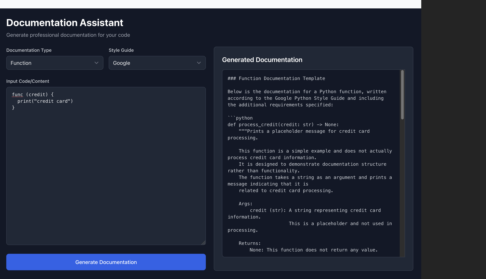

# Documentation Assistant

An AI-powered documentation generator that helps create professional documentation for your code. Built with React + TypeScript for the frontend and FastAPI + OpenAI for the backend.



## Features

- 🤖 AI-powered documentation generation using OpenAI GPT models
- 📝 Multiple documentation styles (Google, NumPy, Sphinx)
- 🎯 Support for various code types:
  - Functions
  - APIs
  - Error Handling
  - Database
  - Workflows
- 🌓 Dark mode interface
- ⚡ Real-time preview
- 🎨 Clean, responsive UI

## Prerequisites

Before you begin, ensure you have installed:
- Python 3.9 or higher
- Node.js 16 or higher
- npm or yarn
- Git
- OpenAI API key

## Quick Start

1. **Clone the repository**
```bash
git clone https://github.com/aiguru-pro/doc-assistant.git
cd doc-assistant
```

2. **Setup Backend**
```bash
# Create and activate virtual environment
cd backend
python -m venv venv
source venv/bin/activate  # On Windows use: venv\Scripts\activate

# Install dependencies
pip install -r requirements.txt

# Create .env file
echo "OPENAI_API_KEY=your_api_key_here" > .env

# Start the backend server
python main.py
```

3. **Setup Frontend**
```bash
# Open a new terminal
cd frontend/doc-assist

# Install dependencies
npm install

# Create .env file
echo "VITE_API_URL=http://localhost:8000" > .env

# Start the frontend development server
npm run dev
```

The application should now be running at:
- Frontend: http://localhost:5173
- Backend: http://localhost:8000

## Project Structure

```
doc-assistant/
├── backend/
│   ├── models.py           # Pydantic models
│   ├── prompt_templates.py # Documentation templates
│   ├── main.py            # FastAPI application
│   ├── requirements.txt   # Python dependencies
│   └── .env              # Backend environment variables
│
├── frontend/
│   ├── src/
│   │   ├── components/    # React components
│   │   ├── config/        # Configuration files
│   │   ├── lib/          # Utility functions
│   │   └── types/        # TypeScript types
│   ├── .env             # Frontend environment variables
│   └── package.json     # Node.js dependencies
│
└── README.md            # This file
```

## Environment Variables

### Backend (.env)
```env
OPENAI_API_KEY=your_openai_api_key_here
```

### Frontend (.env)
```env
VITE_API_URL=http://localhost:8000
```

## API Endpoints

### Generate Documentation
- **URL**: `/generate-docs`
- **Method**: `POST`
- **Request Body**:
```json
{
  "content": "string",
  "doc_type": "function|api|error_handling|database|workflow",
  "style_guide": "google|numpy|sphinx|custom",
  "context": {},
  "examples": []
}
```

## Dependencies

### Backend
```
fastapi==0.109.2
uvicorn==0.27.0
python-dotenv==1.0.1
openai==1.12.0
pydantic==2.6.1
```

### Frontend
```
react
typescript
vite
tailwindcss
```

## Troubleshooting

### Backend Issues

1. **OpenAI API errors**
   - Verify your API key is correct
   - Check your OpenAI account has sufficient credits

2. **Import errors**
   - Ensure your virtual environment is activated
   - Verify all dependencies are installed correctly

### Frontend Issues

1. **"Module not found" errors**
   - Ensure all dependencies are installed
   - Try deleting `node_modules` and running `npm install` again

2. **CORS errors**
   - Ensure the backend server is running
   - Check that `VITE_API_URL` matches your backend URL

## Contributing

1. Fork the repository
2. Create your feature branch (`git checkout -b feature/YourFeature`)
3. Commit your changes (`git commit -m 'Add YourFeature'`)
4. Push to the branch (`git push origin feature/YourFeature`)
5. Open a Pull Request

## Development Tips

1. **Backend Development**
   - Use FastAPI's automatic documentation at `/docs` endpoint
   - Keep environment variables in `.env` file
   - Run the backend in debug mode for better error messages

2. **Frontend Development**
   - Use TypeScript strictly
   - Follow the existing component structure
   - Use Tailwind CSS for styling

## License

[MIT]
